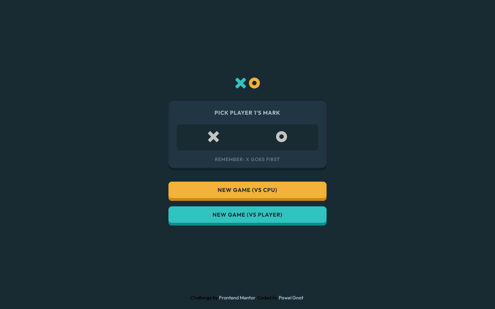

# Frontend Mentor - Tic Tac Toe solution

This is a solution to the [Tic Tac Toe challenge on Frontend Mentor](https://www.frontendmentor.io/challenges/tic-tac-toe-game-Re7ZF_E2v). Frontend Mentor challenges help you improve your coding skills by building realistic projects. 

## Table of contents

- [Overview](#overview)
  - [Screenshot](#screenshot)
  - [Links](#links)
- [My process](#my-process)
  - [Built with](#built-with)
  - [What I learned](#what-i-learned)
- [Author](#author)

## Overview

### Screenshot

### Links

- Live Site URL: [Frontend Mentor Tic Tac Toe](https://pawel-gnat.github.io/Frontend-Mentor-Tic-Tac-Toe-game/)

## My process

I tried to organize my folders structure similar to large scale projects. I find it as an easy method to find code pieces later.

### Built with

- Semantic HTML5 markup
- CSS custom properties
- Flexbox
- Grid
- JavaScript

### What I learned

I completed this challenge within 30,5 hours. I did it with as small html file as possible. Every component is rendered by JavaScript. I tried to create a folders structure similar to professional work. My code surely needs a refactore, but I wanted to go further, so I leave it as it is. I added tiny animations on modal elements. 

## Author

- Frontend Mentor - [@Pawel-Gnat](https://www.frontendmentor.io/profile/Pawel-Gnat)
